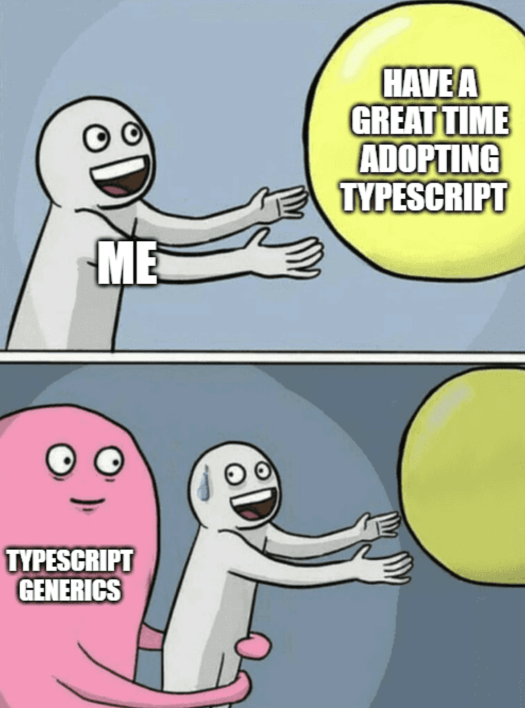
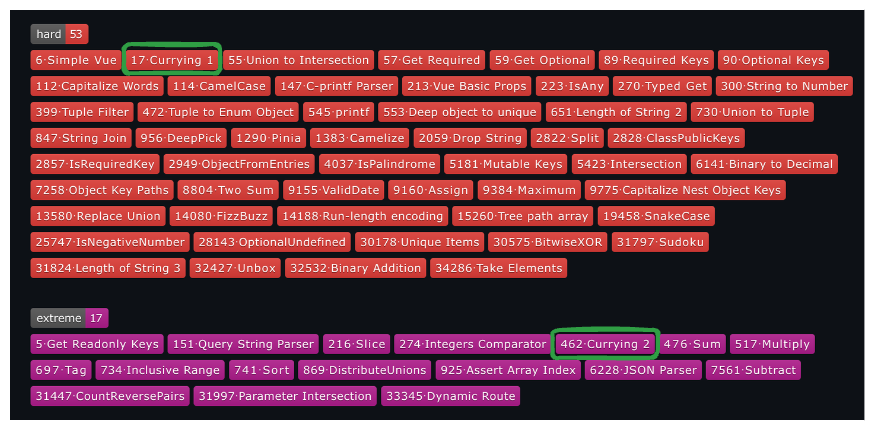

# 타입 레벨 프로그래밍


```tsx
interface TS extends JS {
  typeSafety: true;
}
```

---
# 타입스크립트


- 2012년에 등장

- 자바스크립트의 슈퍼셋

- 정적 타입 언어

---



---


---

# 타입시스템은 완전 튜링하다.
- **튜링 머신** 이란?
 수학자 앨런 튜링이 1936년에 제시한 개념으로 계산하는 기계의 일반적인 개념을 설명하기 위한 가상의 기계이며 오토마타의 일종이다

---

# 증명


---

# 튜링 완전 언어 특징

- 계산 능력
- `조건문`과 `반복문`
- 기억과 상태 (변수 할당)
- . . .

---

# 타입 레벨 프로그래밍

---

# 제네릭 (Generics)
- 제네릭은 선언 시점이 아니라 생성 시점에 타입을 명시하여 하나의 타입만이 아닌 다양한 타입을 사용할 수 있도록 하는 기법

```tsx
type A<T> = T

type B = A<number> // number

type C = A<string> // string
```
---

 개인적으론 타입레벨의 함수라고 생각함.
```ts
type Foo<
  A /* arg 1 */,
  B /* arg 2 */,
  C /* arg 3 */,
> = A & B & C /* return Type */
```

---

# 조건문

`extends` 의 역할은 두가지가 있는데 그중하나가 if의 역할이다.

```ts
type User {
  name: string;
  email: string;
}

type IsHasField<T, FieldName extends string> = FieldName extends keyof T
  ? true
  : false;

type HasEmailField<T> = IsHasField<T, 'email'>

type UseHasEmailField = HasEmailField<User> // true
```

---

# 반복문
- 반복문은 존재하지않지만 타입 재귀는 가능하다!
- 여기서 중요한 키워드는 `infer`

```ts
type IsAllNumber<T extends unknown[]> = T extends [infer First, ...infer Rest]
  ? First extends number
    ? IsAllNumber<Rest>
    : false
  : true;

type A = IsAllNumber<[1, 2, 3]>; // true
type B = IsAllNumber<[1, 2, 'knowre']>; // false
```

---

# Currying의 타입 구현하기
에디터에서 진행

---

# 타입스크립트 챌린지


https://github.com/type-challenges/type-challenges


---



---

# 감사합니다