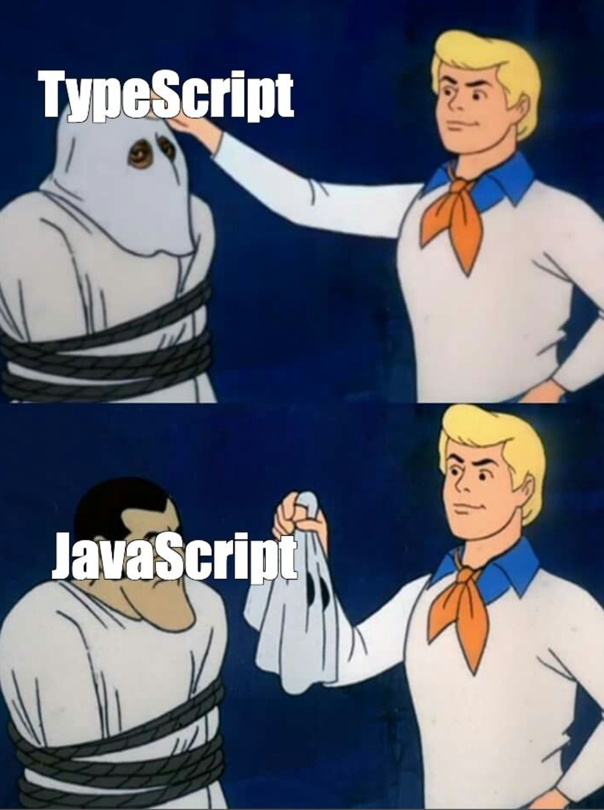
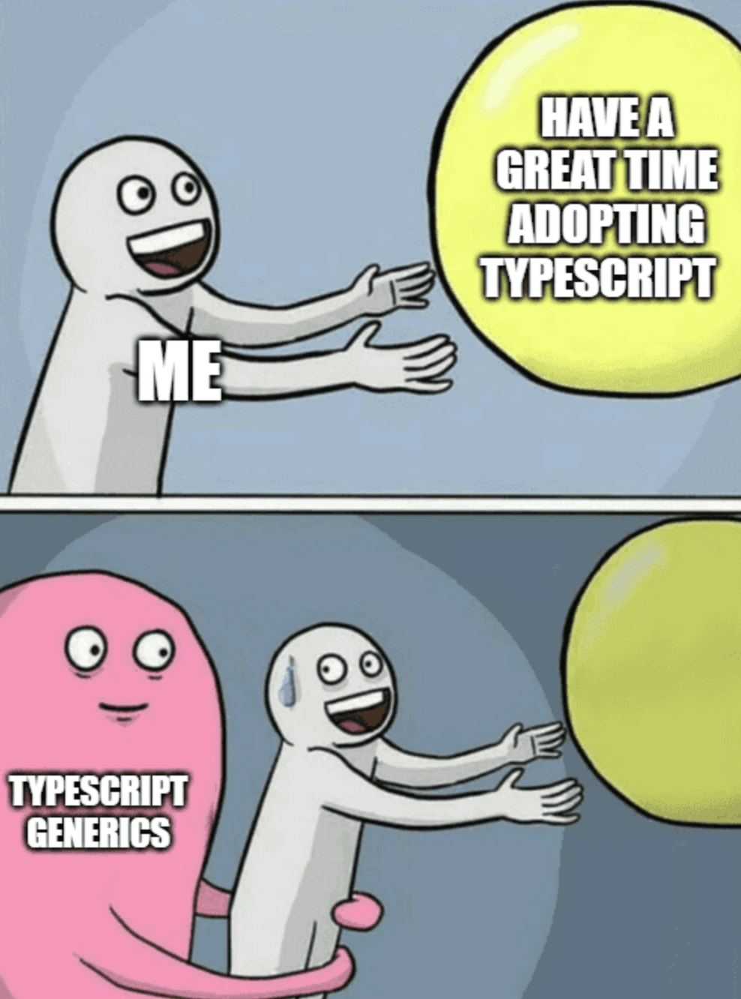
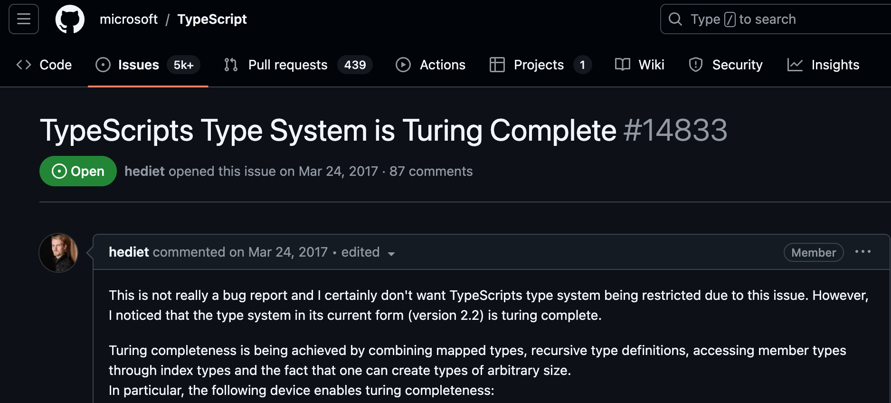
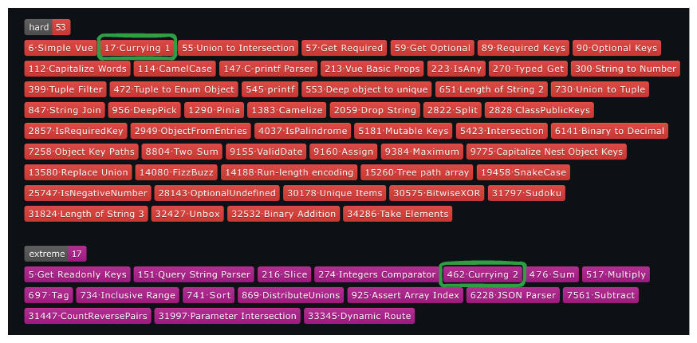

# 타입 레벨 프로그래밍


```tsx
interface TS extends JS {
  typeSafety: true;
}
```

---
# 타입스크립트



- 2012년에 등장

- 자바스크립트의 슈퍼셋

- 정적 타입 언어

---



---


---

`Generics` 에 대하여 잠깐 언급하고 가자면

---

# 제네릭 (Generics)
- 제네릭은 선언 시점이 아니라 생성 시점에 타입을 명시하여 하나의 타입만이 아닌 다양한 타입을 사용할 수 있도록 하는 기법
```tsx
type A<T> = T

type B = A<number> // number

type C = A<string> // string
```
---

 개인적으론 타입레벨의 함수라고 생각함.
```ts
type Foo<
  A /* arg 1 */,
  B /* arg 2 */,
  C /* arg 3 */,
> = A & B & C /* return Type */
```

---

다시 타입스크립트에 대한 이야기로

---

# 타입시스템은 완전 튜링하다.
- **튜링 머신** 이란?
 수학자 앨런 튜링이 1936년에 제시한 개념으로 계산하는 기계의 일반적인 개념을 설명하기 위한 가상의 기계이며 오토마타의 일종이다

---

# 증명


---

# 튜링 완전 언어 특징

- 계산 능력
- `조건문`과 `반복문`
- 기억과 상태 (변수 할당)
- . . .

---

# 조건문

`extends` 의 역할은 두가지가 있는데 그중하나가 if의 역할이다.

```ts
type User {
  name: string;
  email: string;
}

type IsHasField<T, FieldName extends string> = FieldName extends keyof T
  ? true
  : false;

type HasEmailField<T> = IsHasField<T, 'email'>

type UseHasEmailField = HasEmailField<User> // true
```

---

# 반복문
- 반복문은 존재하지않지만 타입 재귀는 가능하다!
- 여기서 중요한 키워드는 `infer`

```ts
type IsAllNumber<T extends unknown[]> = T extends [infer First, ...infer Rest]
  ? First extends number
    ? IsAllNumber<Rest>
    : false
  : true;

type A = IsAllNumber<[1, 2, 3]>; // true
type B = IsAllNumber<[1, 2, 'knowre']>; // false
```

---
# 유틸 타입
```ts
type AnyFn = (...params: any[]) => any;

// 타입스크립트에서 제공되는 유틸 타입
type Parameters<T extends AnyFn> = T extends (...params: infer P) => any
  ? P
  : never;
// Parameters<(a: string, b: number) => boolean> // [a: string, b: number]

type Head<T extends any[]> = T extends [infer First, ...any[]]
  ? First
  : never;
// Head<[1, 2, 3, 4, 5]> // 1

type Tail<T extends any[]> = T extends [any, ...infer Rest]
  ? Rest
  : never;
// Tail<[1, 2, 3, 4, 5]> // [2, 3, 4, 5]

type Length<T extends any[]> = T["length"];
// Length<[1, 2, 3, 4, 5]> // 5
```

---

# Currying의 타입을 만들어볼려고함.
그전에... currying 이란?

---

# 커링 함수

```js
const curry = (fn) => {
  return function curried (...params) {
    if (fn.length === params.length) {
      return fn(...params)
    }

    return curried.bind(this, ...params)
  }
}

const add = (a, b) => a + b

add(3, 11) // 14

const curried = _.curry(abc)

const addFive = curried(5)

addFive(3) // 8
```

---
# 단순화 하여 생각하기
```ts
// 전달 받는 함수의 length가 2일 경우
const add = (a: number, b: number) => a + b;

/**
 * ((a: number, b: number) => number) &
 * ((a: number) => (b: number) => number)
 */
const curried = _.curry(add);
curried(5, 3); // 8

const addFive = curried(5); // (b: number) => number
addFive(3); // 8
```
---
```ts
type AnyFn = (...params: any[]) => any

type HasTail<T extends any[]> = T extends [] | [any] ? false : true;

type Curried<P extends any[], R> = P extends [infer Head, ...infer Rest]
  ? HasTail<P> extends true
    ? ((a: Head, ...b: Rest) => R) & // 모든 인자를 전달해 실행하는 함수
      ((a: Head) => Curried<Rest, R>) // 커링이된 함수 리턴
    : (a: Head) => R // head 하나만 존재할 시
  : never;

type Curry<Fn extends AnyFn> = Curried<Parameters<Fn>, ReturnType<Fn>>;
```
---

```ts
declare function curry <T extends AnyFn>(fn: T): Curry<T>

/** ((a: number, b: number) => number) & ((a: number) => (last: number) => number) */
const curriedAdd = curry(add2);
const five = curriedAdd(2, 3); // number
const addTwo = curriedAdd(2); // (last: number) => number
```

---
# 본격적인 커리 구현

```ts
// 전달받는 함수의 length가 3이상일 경우
const foo = (a: number, b: string, c: boolean) => true;

/**
 * (
 *   (a: number) => (
 *     (b: string) => (c: boolean) => boolean) &
 *     ((b: string, c: boolean) => boolean)
 *   )
 * ) &
 * ((a: number, b: string) => (c: boolean) => boolean) &
 * ((a: number, b: string, c: boolean) => boolean)
 */
const curriedFoo = _.curry(foo);

const a = curriedFoo(3, 'knowre') // (c: boolean) => boolean
const b = curriedFoo(3, 'knowre', false) // true
/**
 *  (b: string) => (c: boolean) => boolean) &
 *  ((b: string, c: boolean) => boolean)
 */
const c = curriedFoo(3)
```
---
```ts
type Curried<P extends any[], R, PrevParams extends any[] = []> = P extends [
  infer Head,
  ...infer Tail
]
  ? HasTail<P> extends true
    ? ((...params: [...PrevParams, Head]) => Curried<Tail, R>) & // 커링된 함수를 리턴.
        Curried<Tail, R, [...PrevParams, Head]> // 커링 없이 실행한 함수 리턴
    : (...params: [...PrevParams, Head]) => R // Arg가 1개 남았을 경우 모든 Prams를 넣어서 실행하는 함수
  : never;

type Curry<Fn extends AnyFn> = Curried<Parameters<Fn>, ReturnType<Fn>>;

// ((params_0: 1) => (params_0: 2) => true) & ((params_0: 1, params_1: 2) => true)
type TestA = Curried<[1 , 2], true>

// (params_0: 1, params_1: 2) => true
type TestB = Curried<[2], true, [1]>

```

---

# 완성된 커링

```ts
namespace _ {
  type AnyFn = (...params: any) => any;
  type HasTail<T extends any[]> = T extends [] | [any] ? false : true;

  type Curried<P extends any[], R, PrevParams extends any[] = []> = P extends [
    infer Head,
    ...infer Tail
  ]
    ? HasTail<P> extends true
      ? ((...params: [...PrevParams, Head]) => Curried<Tail, R>)
          Curried<Tail, R, [...PrevParams, Head]>
      : (...params: [...PrevParams, Head]) => R
    : never;

  type Curry<Fn extends AnyFn> = Curried<Parameters<Fn>, ReturnType<Fn>>;

  export function curry<T extends AnyFn>(fn: T): Curry<T>;
  export function curry(fn: any) {
    return function curried(...params) {
      if (fn.length === params.length) {
        return fn(...params);
      }

      return curried.bind(null, ...params);
    };
  }
}
```

---

# 타입스크립트 챌린지


https://github.com/type-challenges/type-challenges


---



---

# 감사합니다